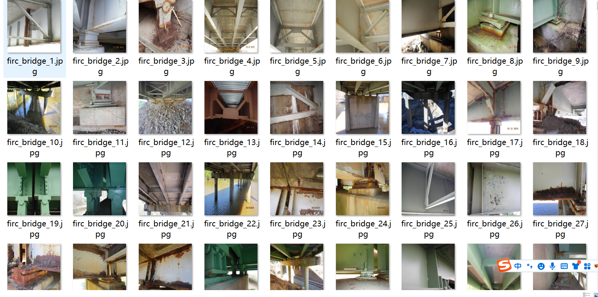
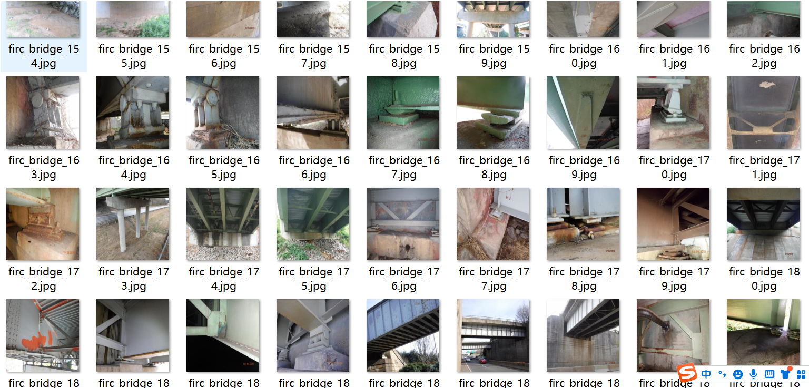
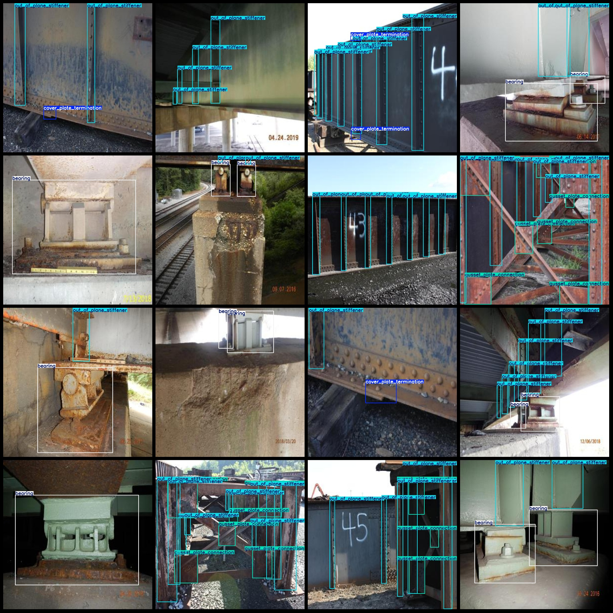
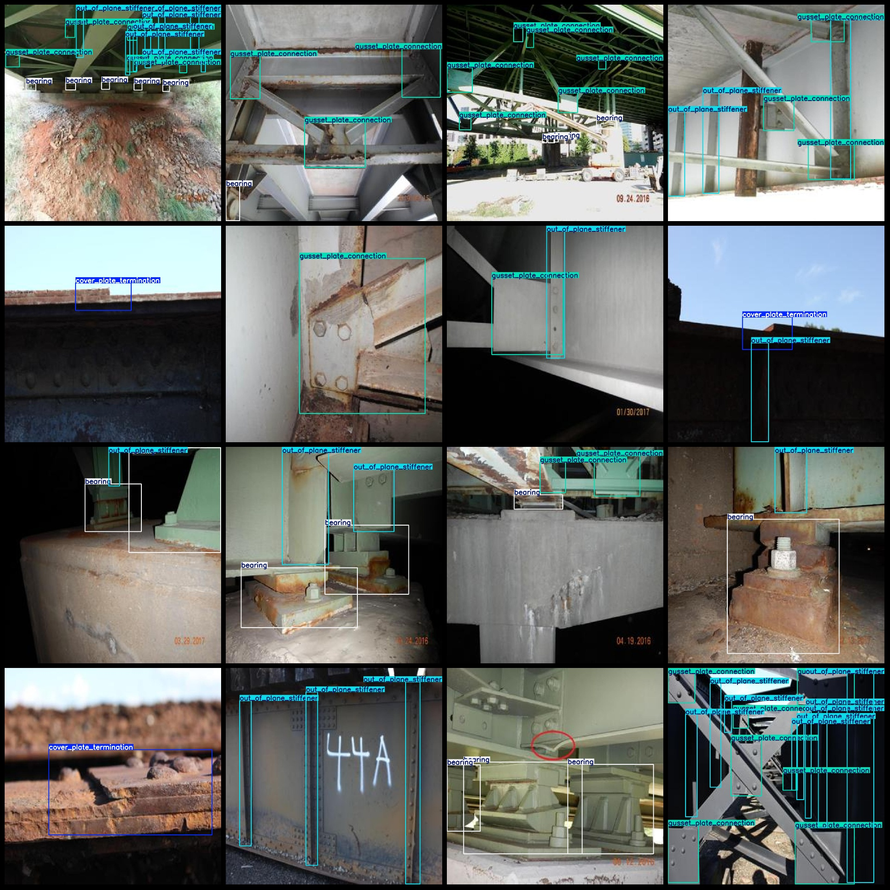

# Bridge Structural Parts and Node Detection Dataset VOC+YOLO Format, 1455 Images with 4 Categories

Dataset Format: Pascal VOC format + YOLO format (txt file without segmentation paths, only including jpg images and corresponding VOC format xml files and yolo format txt files).

Number of Images (jpg Files): 1455
Number of Annotations (xml Files): 1455
Number of Annotations (txt Files): 1455
Number of Annotation Categories: 4
Annotation Category Names: ["bearing", "cover_plate_termination", "gusset_plate_connection", "out_of_plane_stiffener"]
Each Category Number of Boxes:
- Bearing (Bearing/Bearing Support) Boxes = 1820
- Cover Plate Termination (Cover Plate Ending) Boxes = 302
- Gusset Plate Connection (Node Plate Connection) Boxes = 992
- Out of Plane Stiffener (Out of Plane Stiffener) Boxes = 3559
Total Boxes: 6673
Image Resolution: 1280x1280
Annotation Tool Used: labelImg
Annotation Rules: Draw bounding boxes for each category.
Important Notice: The dataset does not have a division into training, validation, or test sets; you must divide them yourself.
Special Remark: This dataset does not guarantee the accuracy of the trained model or weight files.
Image Preview:
Annotation Example:

## Images

Here is a pay link on Stripe ( https://buy.stripe.com/3cs8yP7sY87d0vu9AB ). Please contact me lonlonago@foxmail.com after funding $89, and I will send you a complete data files , thank you!

